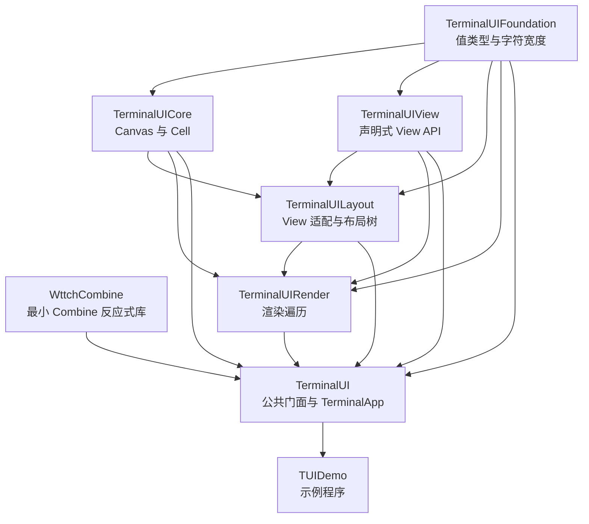

# TUIDemo / TerminalUI

[](https://github.com/wttch-swift/SwiftTUI/actions/workflows/ubuntu.yml)
[](https://github.com/wttch-swift/SwiftTUI/actions/workflows/macos.yml)
[](https://github.com/wttch-swift/SwiftTUI/actions/workflows/windows.yml)

[](https://github.com/wttch-swift/SwiftTUI/actions/workflows/test-ubuntu.yml)
[](https://github.com/wttch-swift/SwiftTUI/actions/workflows/test-macos.yml)
[](https://github.com/wttch-swift/SwiftTUI/actions/workflows/test-windows.yml)

TerminalUI 是一个使用 Swift 编写的声明式终端 UI 实验框架。它借鉴 SwiftUI 的
`View`、`ViewBuilder`、`State`、`Binding`、`FocusState` 和 modifier 组合方式，
但最终把界面布局到终端字符单元格，并通过 ANSI 控制序列增量输出。

仓库同时包含 `TUIDemo` 示例程序，用一个可交互的观测站界面展示布局、表格、
滚动、输入框、焦点、标签页、弹层和文本动画。

## 设计目标

- 让客户端只编写接近 SwiftUI 的声明式 View，不接触布局节点或 Canvas。
- 将 View 声明、布局算法、字符画布和终端宿主拆成单向依赖的模块。
- 正确处理 CJK、Emoji、组合字符等宽字符，避免拆分 grapheme 或遗留半个字符。
- 在终端约束下提供状态刷新、焦点导航、滚动、文本编辑和增量绘制。
- 使用 Swift `package` 访问级别隔离内部协议，而不是把下划线类型作为公共 API。

## 架构



图中 `A --> B` 表示 **B 直接依赖 A**，也就是依赖从底层流向上层，源码导入方向
与箭头相反。`TerminalUIFoundation` 与 `WttchCombine` 是没有内部依赖的叶子 target；
客户端入口位于最上层的 `TerminalUI`。

## Package 依赖关系

下表与 `Package.swift` 中的 target 声明保持一致，只列出直接依赖：

| Target | 直接依赖 | 类型与可见性 |
| --- | --- | --- |
| `TerminalUIFoundation` | 无 | 基础 target，不单独发布 product |
| `WttchCombine` | 无 | 最小 Combine 反应式库，由 `TerminalUI` 使用 |
| `TerminalUICore` | `TerminalUIFoundation` | package 内部渲染基础设施 |
| `TerminalUIView` | `TerminalUIFoundation` | 公共声明 API，由 `TerminalUI` 重新导出 |
| `TerminalUILayout` | `TerminalUIFoundation`、`TerminalUICore`、`TerminalUIView` | package 内部布局实现 |
| `TerminalUIRender` | `TerminalUIFoundation`、`TerminalUICore`、`TerminalUIView`、`TerminalUILayout` | package 内部渲染协调器 |
| `TerminalUI` | Foundation、Core、View、Layout、Render 五个 target | 唯一 library product |
| `TUIDemo` | `TerminalUI` | 示例 executable target |
| `TUIDemoTests` | `TerminalUI`、Core、View、Layout、Render | package 内部测试 target |

这里刻意让 `TerminalUIView` 和 `TerminalUICore` 保持平级：View 声明不会接触 Canvas，
Core 也不会导入 View。二者第一次汇合于 `TerminalUILayout`，随后由
`TerminalUIRender` 负责把布局树绘制到 Canvas。`TerminalUI` 同时依赖这些 target，
是因为它需要用 `TerminalApp` 串联完整运行时，但只把声明式 API 和宿主入口暴露给
客户端。

维护依赖时应遵循以下约束：

- Foundation 不得依赖其他 TerminalUI target。
- WttchCombine 是无依赖叶子，不反向依赖任何 TerminalUI target。
- Core 与 View 不得互相依赖。
- Layout 可以依赖 Foundation、Core 和 View，但不得依赖 Render 或 TerminalUI。
- Render 可以依赖下层实现，但不得反向依赖 TerminalUI 宿主。
- 应用和外部 package 只依赖 `TerminalUI` product。

一帧界面的主要数据流为：

```text
View 声明
  -> _LayoutNodeProducing 适配
  -> measure(proposed:)
  -> layout(in:)
  -> Render 深度优先遍历
  -> Canvas 字符单元格
  -> ANSI 增量输出
```

依赖方向必须保持单向。特别是 `TerminalUIView` 不依赖 `TerminalUILayout`，因此
`Text`、`VStack` 等声明不会知道 `_LayoutNode` 的存在。具体节点生成由 Layout
模块中的扩展完成。

## 模块导航

| 模块 | 职责 | 客户端是否应直接使用 |
| --- | --- | --- |
| [TerminalUIFoundation](Sources/TerminalUIFoundation/README.md) | 几何、颜色、边框、Unicode 单元格宽度 | 通常通过 `TerminalUI` 间接使用 |
| [TerminalUICore](Sources/TerminalUICore/README.md) | Canvas、Cell、ANSI 输出与裁剪 | 否，package 内部实现 |
| [TerminalUIView](Sources/TerminalUIView/README.md) | SwiftUI 风格的 View 声明和状态 API | 由 `TerminalUI` 重新导出 |
| [TerminalUILayout](Sources/TerminalUILayout/README.md) | View 到 LayoutNode 的适配和布局算法 | 否，package 内部实现 |
| [TerminalUIRender](Sources/TerminalUIRender/README.md) | 环境传播、裁剪和绘制遍历 | 否，package 内部实现 |
| [TerminalUI](Sources/TerminalUI/README.md) | 最终公共入口、终端尺寸和事件循环 | 是 |
| [TUIDemo](Sources/TUIDemo/README.md) | 完整交互示例 | 可作为用法参考 |

Swift Package 当前只发布一个 library product：`TerminalUI`。其他 target 用来建立
编译边界；内部关键类型使用 `package` 或默认访问级别，即使模块随依赖被构建，
外部 package 也无法调用这些实现接口。

## 快速开始

在另一个 Swift Package 中添加本仓库依赖，并只依赖 `TerminalUI` product：

```swift
.package(path: "../TUIDemo")
```

```swift
.executableTarget(
    name: "Example",
    dependencies: [
        .product(name: "TerminalUI", package: "TUIDemo")
    ]
)
```

最小应用：

```swift
import TerminalUI

struct CounterView: View {
    @State private var count = 0

    var body: some View {
        VStack {
            Text("TerminalUI")
                .bold()
                .foregroundColor(.brightCyan)
            Text("Count: \(count)")
            Text("Press + to increment, q to quit")
                .foregroundColor(.brightBlack)
        }
        .padding()
        .bordered()
        .onKeyPress { event in
            switch event.key {
            case .character("+"):
                count += 1
                return .handled
            case .character("q"):
                TerminalStateRuntime.stop()
                return .handled
            default:
                return .ignored
            }
        }
    }
}

let size = TerminalSizeReader.current(
    or: TerminalSize(columns: 80, rows: 24)
)
let app = TerminalApp(width: size.width, height: size.height) {
    CounterView()
}
try app.run()
```

## 已有能力

- 布局：`HStack`、`VStack`、`ZStack`、`Spacer`、`GeometryReader`、`frame`、
  `padding`、`background` 和 `bordered`。
- 数据：`State`、`Binding`、`ForEach`、`Table` 和环境值传播。
- 交互：`TextField`、`Toggle`、`FocusState`、`onKeyPress`、`ScrollView`、
  `TabView`、`sheet` 和 `toast`。
- 显示：自动换行与省略号、宽字符、颜色降级、粗体、斜体、下划线、删除线、
  `ProgressBar` 和 `AnimatedText`。
- 运行时：终端尺寸读取、按键解码、16 ms 事件轮询、信号/挂起恢复、
  状态触发重绘和差异输出。
- 反应式：WttchCombine 最小 Publisher/Subject 与按键全局流
  `TerminalKeyEvents.stream`，视图 `.onKeyPress` 的底层数据来源即该流。

## 开发与测试

```bash
swift build
swift test
swift run TUIDemo
```

当前测试覆盖布局约束、宽字符、Canvas 输出、颜色降级、焦点、输入框、滚动、
表格、标签页、弹层以及状态保持。修改模块边界时还应验证一个只依赖
`TerminalUI` product 的外部客户端可以编译，同时无法引用 `_LayoutNode`、
`Canvas` 或 `Render`。

## 扩展一个新 View

新增基础组件时通常分两步：

1. 在 `TerminalUIView` 中定义纯声明类型，只保存构建布局所需的数据。
2. 在 `TerminalUILayout` 中让该类型遵循 package 级 `_LayoutNodeProducing`，创建并
   返回具体布局节点。

若节点只负责测量和摆放，实现 `_LayoutNode` 即可；只有需要直接写入字符画布的
节点才遵循 `_RenderableLayoutNode`。渲染遍历依赖能力协议识别环境、裁剪等行为，
不应反向依赖某个具体 View 类型。
